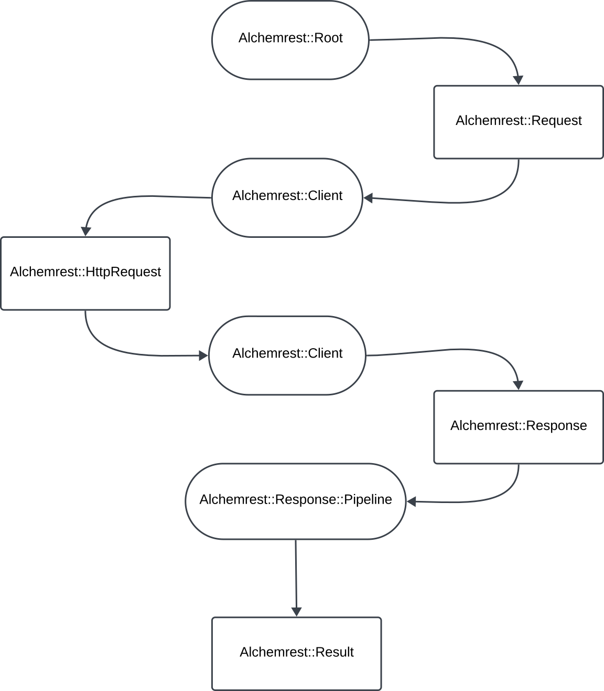

# Architecture of AlchemREST

This documentation is meant to give readers an overview of the internal of AlchemREST itself. It's meant to help those interested in contributing, or just interested in understanding how AlchemREST works under the hood.

To understand how AlchemREST works, you generally want to focus on 3 key parts of the framework

* Faraday Configuration and Setup
* The AlchemREST Request Processing Flow
* Morpher Data Transforms
* Results Pattern Matching Internals

## Faraday Configuration and Setup

Behind the scenes, the actual http layer for AlchemREST is powered by Faraday. The interface between Faraday and the rest of AlchemREST is the `Alchemrest::Client#connection`. Implementors can override this method directly and just build the `Faraday::Connection` manually, but more typically they'll make use of the DSL we have to set up and configure a connection. This DSL is exposed by `Alchemrest::Client#configure` and consists of two different pieces.

* `Alchemrest::Client::Configuration` - An object that exposes attributes that let the implementor set configuration settings for a given client
* `Alchemrest::Client::Configuration::Connection` - An object that exposes an interface to build and customize a `Faraday::Connection` directly.

## AlchemREST Request Processing Flow

To understand the process flow, let's start with this diagram



In the diagram above, you can think of the rectangular steps in the flow as inputs and outputs that are produced and then consumed at each step of the flow, while the ovals represent processing components that use each output from the previous step, as input to product the next output. So the `Alchemrest::Root` produces an `Alchemrest::Request` which is used by an `Alchemrest::Client` to produce a `Alchemrest::HttpRequest`, etc. To dig into this flow we'll tackle each processor/output pair in order, walking through how they work.

### Alchemrest::Root -> Alchemrest::Request

The first step in the flow takes an AlchemREST root, and uses it to build an AlchemREST request. Generally, root instances serve as the gateway from your domain objects, into AlchemREST. Your root exposes methods that build and execute your requests, as defined by the use of the `define_request` macro. Let's take a look at how that method actually works so we can understand this first step of the process.

[source](../alchemrest/lib/alchemrest/root.rb)

```ruby
def self.define_request(name, request_class, with_params: nil)
  request_definitions[name] = RequestDefinition.new(name, request_class, with_params)

  define_method(name) do |params = {}|
    build_request(name, params).execute!
  end
end
```

So you can see on the surface, this method is pretty simple. We build a `RequestDefinition` instance, store it in a hash of request definitions by name, and then define a method that calls `build_request` and then executes the request. Looking at `build_request` we see this.

```ruby
  def build_request(name, params = {})
    request_definition = self.class.request_definitions[name]

    raise "No request definition found for #{name}. Did you call `define_request :#{name} in your root class?" unless request_definition

    request = request_definition.build_request(self, params)
    client.build_http_request(request)
  end
```

So, here, we simply reload that same `RequestDefinition` we created earlier, and call it's own `build_request` method, which gives us an `Alchemrest::Request`, which we store in the variable `request`. For now we'll ignore the last line `client.build_http_request`, and instead, look a little closer at how `RequestDefinition` creates the `Alchemrest::Request` object. We can see the `RequestDefinition` [source here](../alchemrest/lib/alchemrest/request_definition.rb). Essentially this class is initialized with a name, the `Alchemrest::Request` class defining the request, and a block which is used to generate the default params for the request. When you call `RequestDefinition#build_request`, you pass in any additional params, along with the `Alchemrest::Root` instance as context. Then we execute the default params block against the root, to get the default params, merge that with the additional params, and new up an instance of the `Alchemrest::Request` class passed in. Now we have an instance of `Alchemrest::Request` we're ready to turn into an actual http request.

### Alchemrest::Request -> Alchemrest::Client -> Alchemrest::HttpRequest

By itself, an `Alchemrest::Request` is not executable. If you look at the source for `Alchemrest::Request` you'll see it has no references to the underlying Faraday client we use to make requests, or anything else that actually lets it hook into the real http layer. For that you need to look to the `Alchemrest::HttpRequest` class ([source](../alchemrest/lib/alchemrest/http_request.rb)). This class wraps the `Alchemrest::Request` instance and builds up a real http request, and then executes it against the underlying `Faraday::Connection`.

We build our `Alchemrest::HttpRequest` instances using the `Alchemrest::Client`. If we go back to our definition of `Alchemrest::Root#build_request` we can see this happening in the last line of that method

```ruby
  def build_request(name, params = {})
    request_definition = self.class.request_definitions[name]

    raise "No request definition found for #{name}. Did you call `define_request :#{name} in your root class?" unless request_definition

    request = request_definition.build_request(self, params)
    client.build_http_request(request)
  end
```

In this method `client` is an `Alchemrest::Client` ([source](../alchemrest/lib/alchemrest/client.rb)), generally associated with a root using the `use_client` macro. Looking at it's `build_http_request` method, we see this simple implementation

```ruby
  def build_http_request(request)
    HttpRequest.new(request, self)
  end
```

Now at this point in the pipeline, we have a `Alchemrest::HttpRequest` that's ready to be executed.

### Alchemrest::HttpRequest -> Alchemrest::Client -> Alchemrest::Response

The next step is to actually execute this request, and get a response. Again, the `Alchemrest::Client` sits at the center of this step, orchestrating the actual http request via our `Faraday::Connection` and converting the `Faraday::Response` into an `Alchemrest::Response`.

This process actually starts inside the `Alchemrest::HttpRequest` class, via its `execute!` method, which looks like this.

```ruby
def execute!
  result = Result.for do |try|
    raw_response = try.unwrap make_request!
    transform_response(build_response(raw_response))
  end

  circuit_breaker.monitor!(result:)
  result
end
```

You can see that this invokes `make_request!` which looks like this

```ruby
def make_request!
  return Result::Error(CircuitOpenError.new) if circuit_breaker.open?

  # We have to set the body in the block form, otherwise it will be ignored for
  # delete requests. See https://github.com/lostisland/faraday/issues/693#issuecomment-466086832
  response = @client.connection.public_send(http_method, path, nil, headers) do |req|
    req.body = body
  end
  Result::Ok(response)
rescue Faraday::Error => e
  handle_faraday_error(e)
rescue *Alchemrest.rescuable_exceptions => e
  Result::Error(e)
end
```

Here in make request, you can see we use the client to get our Faraday connection and actually execute the API request. We handle a bunch of different types of errors by ensuring we return an `Alchemrest::Result::Error` object that wraps the error, or we return an `Alchemrest::Result::Ok` object if the request worked. Then back inside `execute!` we unwrap that result value, and convert it to an Alchemrest response. To build that response, we delegate to `Alchemrest::Client`. The client's `build_response` method just looks like this

```ruby
def build_response(raw_response)
  Response.new(raw_response)
end
```

Note, this method is often overridden by implementers so that they can have custom `Alchemrest::Response` classes that are specific to a particular API. But the end result is the same. We have a `Alchemrest::Response` instance that has access to the underlying http response data for further processing in the final step.

If our request didn't succeed, then we'll return the `Alchemrest::Result::Error` object generated by `make_request!` for downstream consumers to handle.

Lastly, note in this step, we pass this same result into our circuit breaker to see if it's a failure that should trip our circuit. This is a side effect that doesn't actually affect the transformation in this step of the pipeline.

### Alchemrest::Response -> Alchemrest::Response::Pipeline -> Alchemrest::Result

Our final step takes this `Alchemrest::Response` object, sends it through a `Alchemrest::Response::Pipeline` and creates an `Alchemrest::Result`. The code here is a little more indirect, and will require more explanation, but let's just start at the beginning and work our way forward. If we go back to `Alchemrest::HttpRequest` we can see how we enter into this step via its `execute!` method.

```ruby
def execute!
  result = Result.for do |try|
    raw_response = try.unwrap make_request!
    transform_response(build_response(raw_response))
  end
  # circuit breaker stuff we're ignoring now.
end
```

So the `Alchemrest::Response` we build in the previous step, is now passed into `transform_response`. You'll notice that `transform_response` is not defined on `Alchemrest::HttpRequest`, instead we're relying on the fact that `Alchemrest::HttpRequest` is a `SimpleDelegator` that wraps `Alchemrest::Request`. So if we go look at `transform_response` there, we'll see

```ruby
def transform_response(response)
  capture!(response:)
  response_transformer.call(response)
end
```

We'll skip the first part of this method `capture!`, which will cover later when we talk about request capture. For now, you can see that the core of this method is just `response_transformer.call(response)`. So if we look at `response_transformer` we see

```ruby
def response_transformer
  Alchemrest::Response::Pipeline.new(
    Alchemrest::Response::Pipeline::WasSuccessful.new,
  )
end
```

Here, you can see the `Alchemrest::Response::Pipeline` class, mentioned in the diagram. This is where the actual transformation takes place. So let's look at [this class here](../alchemrest/lib/alchemrest/response/pipeline.rb). As you'll see looking at its source, a `Pipeline` is just a list of `Morpher::Transform` instances that we will run our `Alchemrest::Response` through. (for more on transforms see [Custom Transformations](./custom_transformations.md)). A pipeline takes in the list of `Morpher::Transform` instances as it's only initialization param, and then invoking `call` will send the `Alchemrest::Response` through each of those transformations in order, constructing an `Alchemrest::Result` object as an output.

In this case, we can see our pipeline consists of one step, which uses the `WasSuccessful` transformation. If we look at the [source](../alchemrest/lib/alchemrest/response/pipeline/was_successful.rb) for that class we see that it simply checks to see if the response has a success error code, or a failure error code, and then returns either the response object itself, or the error accordingly.

At this point you may be wondering, just how we get from here to an `Alchemrest::Data` instance. Well for that, let's take a quick look at the `Alchemrest::Result.returns` macro, that we use when we want a request to return a specific `Alchemrest::Data` type. I won't paste the whole method here, since it's rather long, but you see that in this method we build up a new `Alchemrest::Response::Pipeline` instance that looks like this

```ruby
Alchemrest::Response::Pipeline.new(
  Alchemrest::Response::Pipeline::WasSuccessful.new,
  Alchemrest::Response::Pipeline::ExtractPayload.new(path_to_payload),
  domain_type::TRANSFORM,
)
```

We then override the `response_transformer` method, and return this new pipeline instead.

Now you can see how we produce our `Alchemrest::Data` output. This new pipeline still checks if the request was successful, but then adds 2 more steps.

* `ExtractPayload` ([source](../alchemrest/lib/alchemrest/response/pipeline/extract_payload.rb)) which drills down into a response and pulls out the actual payload we care about. This is to handle situations where the response always has some top level property like `data` which holds the underlying payload
* `domain_type::TRANSFORM` is a dynamically defined transformation that lives on a given `Alchemrest::Data` class. `domain_type` is whatever class you pass into `returns` and `TRANSFORM` is the `Morpher::Transform` that converts a hash into that particular class.

This, flexible pipeline based approach allows implementors to add additional custom steps if they'd like, to convert how we go from `Alchemrest::Response` to `Alchemrest::Result`.

### Response Capture Addendum

When we looked at the `Alchemrest::Request#transform_response` method, we glossed over some elements related to [response capture](./capturing_responses_for_debugging.md). We'll briefly discuss those now.

As you can see the `transform_response` method calls `capture!` which itself looks like this

```ruby
def capture!(response:)
  ResponseCapturedHandler.new(request: self, response:).call
end
```

You can see that this simply builds a new `Alchemrest::ResponseCapturedHandler` ([source](../alchemrest/lib/alchemrest/response_captured_handler.rb)) and passes in the request and the response.

Inside the capture handler, the bulk of the work happens in `call`

```ruby
def call
  return unless request.response_capture_enabled

  unless Alchemrest.on_response_captured
    default_capture_method
    return
  end

  Alchemrest.on_response_captured.call(identifier:, result: capture_pipeline_result)
end
```

This method consists of 3 parts

1. A guard clause that exits if the request doesn't even have response capture enabled in the first place
2. A second guard clause the will use the default capture method which just writes to the log if we haven't defined a global capture method
3. A final clause that will call our global capture lambda.

Looking at that final clause, you can see what actually gets piped into the capture framework.

* `identifier` - This is just the requests http method + the path of the request. Serves as a means to identify which request this is
* `capture_pipeline_result` - This is an `Alchemrest::Result`, produced by an `Alchemrest::Response::Pipeline`. This pipeline works just like we saw in the main transformation flow, but it's a separate pipeline with different transformation steps. You can see the default pipeline on `Alchemrest::Request#capture_transformer`

```ruby
def capture_transformer
   Alchemrest::Response::Pipeline.new(
     Alchemrest::Response::Pipeline::ExtractPayload.new,
     Alchemrest::Response::Pipeline::Sanitize.new,
   )
end
```

You can see how this pipeline differs from the main one we saw above. First off, we don't include the `WasSuccessful` step. This is because we want to capture all HTTP responses, even those that have failing status codes. Instead, we process the response no matter the http status, extract the payload, and then sanitize it to strip out sensitive data, and then return an `Alchemrest::Result::Ok` wrapping the data we are ready to capture.

Just like before, you can add steps to this pipeline to further customize the capture process. And similar to the main transformation pipeline we have macros like `configure_response_capture` which provide a simple DSL for some customization to this pipeline.

## Morpher Data Transforms

See [Custom Transformations](./custom_transformations.md)

## Results Pattern Matching Internals

See [Advanced Pattern Matching](./advanced_pattern_matching.md)
